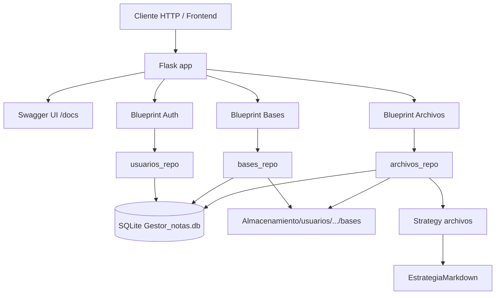
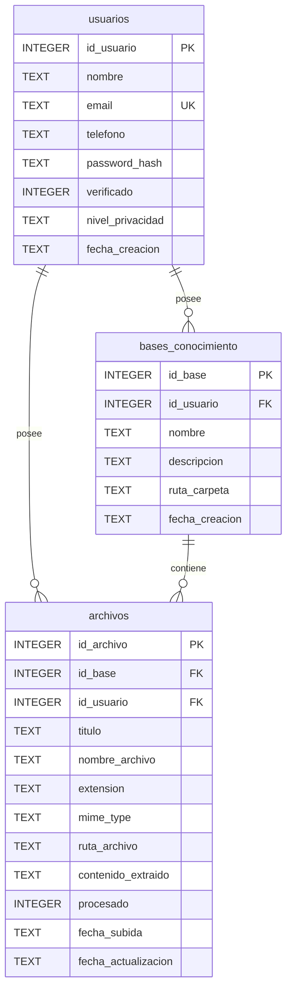
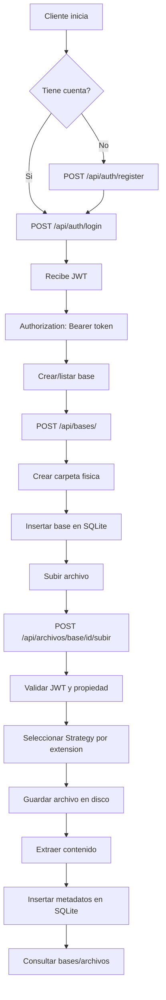
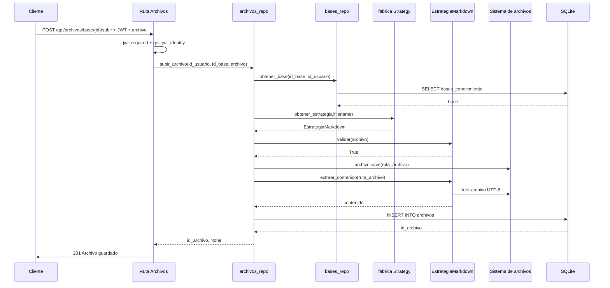

# Reporte tecnico del sistema: Gestor Inteligente de Notas

Fecha de analisis: 2026-05-28

## 1. Resumen ejecutivo

El proyecto es una API backend construida con Flask para gestionar usuarios, autenticacion con JWT, bases de conocimiento y archivos asociados a dichas bases. El sistema guarda dos tipos de informacion:

- Informacion estructurada en una base de datos SQLite: usuarios, bases de conocimiento y metadatos de archivos.
- Informacion fisica en el sistema de archivos: carpetas de bases de conocimiento y archivos subidos por cada usuario.

La aplicacion esta pensada como un backend modular. Cada grupo funcional se expone mediante un Blueprint de Flask:

- `App/Rutas/Autenticacion.py`: registro e inicio de sesion.
- `App/Rutas/Bases.py`: CRUD de bases de conocimiento.
- `App/Rutas/Archivos.py`: carga, consulta y eliminacion de archivos.

La documentacion OpenAPI se encuentra en `App/static/swagger.json` y se publica mediante Swagger UI en `/docs`.

## 2. Tecnologias y bibliotecas utilizadas

| Tecnologia / biblioteca | Uso dentro del sistema |
|---|---|
| Python | Lenguaje principal del backend. |
| Flask | Framework web usado para crear la API HTTP. |
| Flask Blueprints | Separacion modular de rutas por dominio funcional. |
| flask-jwt-extended | Generacion y validacion de tokens JWT para proteger endpoints. |
| flask-cors | Habilita CORS para permitir peticiones desde clientes externos. |
| flask-swagger-ui | Sirve la interfaz visual de documentacion en `/docs`. |
| bcrypt | Hash y verificacion segura de contrasenas. |
| sqlite3 | Acceso directo a base de datos SQLite sin ORM. |
| pathlib | Construccion portable de rutas del sistema de archivos. |
| shutil | Eliminacion recursiva de carpetas de bases de conocimiento. |
| werkzeug.utils.secure_filename | Sanitizacion de nombres de archivo antes de guardarlos. |
| abc | Definicion de una interfaz abstracta para estrategias de archivos. |

Nota: `requirements.txt` declara `flask`, `flask-jwt-extended`, `flask-cors` y `bcrypt`. El codigo tambien importa `flask_swagger_ui`, por lo que esa dependencia debe estar instalada aunque no aparezca actualmente en `requirements.txt`.

## 3. Estructura general del proyecto

```text
Backend/
├── App/
│   ├── __init__.py
│   ├── config.py
│   ├── static/
│   │   └── swagger.json
│   ├── Rutas/
│   │   ├── Autenticacion.py
│   │   ├── Bases.py
│   │   └── Archivos.py
│   ├── Seguridad/
│   │   └── Passwords.py
│   └── Infraestructura/
│       ├── base_datos.py
│       ├── esquema.sql
│       ├── Repositorios/
│       │   ├── usuarios_repo.py
│       │   ├── bases_repo.py
│       │   ├── archivos_repo.py
│       │   └── notas_repo.py
│       └── Strategy_archivos/
│           ├── strategy.py
│           ├── markdown.py
│           ├── texto.py
│           └── fabrica.py
├── Almacenamiento/
├── Instancia/
│   └── Gestor_notas.db
├── run.py
└── requirements.txt
```

## 4. Arquitectura del sistema

La arquitectura es una API Flask con separacion en capas ligera:

| Capa | Archivos principales | Responsabilidad |
|---|---|---|
| Entrada HTTP | `run.py`, `App/__init__.py` | Crear la app, iniciar base de datos, registrar rutas y documentacion. |
| Rutas / Controladores | `App/Rutas/*.py` | Recibir solicitudes HTTP, validar datos basicos, obtener usuario autenticado y devolver JSON. |
| Seguridad | `App/Seguridad/Passwords.py`, JWT en rutas | Hash de contrasenas, login y proteccion de endpoints. |
| Repositorios | `App/Infraestructura/Repositorios/*.py` | Encapsular operaciones SQL y operaciones de persistencia en archivos. |
| Infraestructura DB | `App/Infraestructura/base_datos.py`, `esquema.sql` | Crear conexiones SQLite e inicializar la base. |
| Estrategias de archivos | `App/Infraestructura/Strategy_archivos/*.py` | Validar y extraer contenido segun tipo de archivo. |
| Documentacion | `App/static/swagger.json` | Describir endpoints, parametros, schemas y seguridad bearer JWT. |

### 4.1 Diagrama de arquitectura



## 5. Funcionamiento de Flask dentro del codigo

### 5.1 Punto de entrada: `run.py`

`run.py` realiza tres acciones principales:

1. Importa `create_app` desde `App`.
2. Ejecuta `initialize_database()` para crear la base SQLite si todavia no existe.
3. Crea la instancia Flask con `app = create_app()`.

Tambien define el endpoint raiz `/`, que responde:

```json
{
  "message": "API Gestor Inteligente de Notas funcionando"
}
```

Si el archivo se ejecuta directamente, llama `app.run(debug=True)`.

### 5.2 Application Factory: `App/__init__.py`

El sistema usa el patron Application Factory mediante la funcion `create_app()`. Este patron concentra la construccion de la aplicacion:

- Crea `app = Flask(__name__)`.
- Define secretos de Flask y JWT.
- Inicializa `JWTManager(app)`.
- Inicializa `CORS(app)`.
- Importa y registra Blueprints:
  - `/api/auth`
  - `/api/archivos`
  - `/api/bases`
- Configura Swagger UI:
  - Interfaz: `/docs`
  - Especificacion: `/static/swagger.json`

### 5.3 Blueprints

Los Blueprints separan las rutas por modulo:

| Blueprint | Archivo | Prefijo | Funcion |
|---|---|---|---|
| `auth_bp` | `App/Rutas/Autenticacion.py` | `/api/auth` | Registro y login. |
| `bases_bp` | `App/Rutas/Bases.py` | `/api/bases` | CRUD de bases de conocimiento. |
| `archivos_bp` | `App/Rutas/Archivos.py` | `/api/archivos` | Subida, listado, consulta y eliminacion de archivos. |

## 6. Configuracion

`App/config.py` define rutas centrales:

| Constante | Valor conceptual | Uso |
|---|---|---|
| `BASE_DIR` | Raiz del backend | Base para construir rutas absolutas. |
| `DB_PATH` | `Instancia/Gestor_notas.db` | Archivo SQLite. |
| `SCHEMA_PATH` | `App/Infraestructura/esquema.sql` | Script SQL inicial. |
| `ALMACENAMIENTO_PATH` | `Almacenamiento` | Carpeta donde se guardan archivos y carpetas de bases. |

## 7. Base de datos

La base de datos usa SQLite. El archivo se guarda en:

```text
Instancia/Gestor_notas.db
```

El esquema inicial esta en:

```text
App/Infraestructura/esquema.sql
```

`initialize_database()` crea la carpeta `Instancia` si no existe. Si el archivo `.db` ya existe, no lo recrea. Si no existe, lee `esquema.sql`, ejecuta el script completo, confirma cambios y cierra la conexion.

### 7.1 Conexion

`get_connection()` en `base_datos.py`:

- Abre una conexion con `sqlite3.connect(DB_PATH)`.
- Configura `row_factory = sqlite3.Row`, lo que permite acceder a columnas por nombre.
- Activa `PRAGMA foreign_keys = ON`, necesario para que SQLite aplique relaciones y borrados en cascada.

### 7.2 Tablas y atributos

#### Tabla `usuarios`

| Campo | Tipo | Restriccion / default | Descripcion |
|---|---|---|---|
| `id_usuario` | INTEGER | PRIMARY KEY AUTOINCREMENT | Identificador unico del usuario. |
| `nombre` | TEXT | NOT NULL | Nombre del usuario. |
| `email` | TEXT | UNIQUE NOT NULL | Correo usado para login. |
| `telefono` | TEXT | Opcional | Telefono del usuario. |
| `password_hash` | TEXT | NOT NULL | Hash bcrypt de la contrasena. |
| `verificado` | INTEGER | DEFAULT 0 | Bandera de verificacion. |
| `nivel_privacidad` | TEXT | DEFAULT 'privado' | Nivel de privacidad del usuario. |
| `fecha_creacion` | TEXT | DEFAULT CURRENT_TIMESTAMP | Fecha de alta. |

#### Tabla `bases_conocimiento`

| Campo | Tipo | Restriccion / default | Descripcion |
|---|---|---|---|
| `id_base` | INTEGER | PRIMARY KEY AUTOINCREMENT | Identificador unico de la base. |
| `id_usuario` | INTEGER | NOT NULL, FK | Usuario propietario. |
| `nombre` | TEXT | NOT NULL | Nombre visible de la base. |
| `descripcion` | TEXT | Opcional | Descripcion de la base. |
| `ruta_carpeta` | TEXT | NOT NULL | Ruta fisica donde se guardan archivos. |
| `fecha_creacion` | TEXT | DEFAULT CURRENT_TIMESTAMP | Fecha de creacion. |

Relacion:

- `bases_conocimiento.id_usuario` referencia `usuarios.id_usuario`.
- `ON DELETE CASCADE`: si se elimina un usuario, se eliminan sus bases.

#### Tabla `archivos`

| Campo | Tipo | Restriccion / default | Descripcion |
|---|---|---|---|
| `id_archivo` | INTEGER | PRIMARY KEY AUTOINCREMENT | Identificador unico del archivo. |
| `id_base` | INTEGER | NOT NULL, FK | Base a la que pertenece. |
| `id_usuario` | INTEGER | NOT NULL, FK | Usuario propietario. |
| `titulo` | TEXT | NOT NULL | Titulo derivado del nombre del archivo. |
| `nombre_archivo` | TEXT | NOT NULL | Nombre seguro del archivo. |
| `extension` | TEXT | NOT NULL | Extension, por ejemplo `.md`. |
| `mime_type` | TEXT | Opcional | MIME recibido en la subida. |
| `ruta_archivo` | TEXT | NOT NULL | Ubicacion fisica del archivo. |
| `contenido_extraido` | TEXT | Opcional | Texto extraido por la estrategia. |
| `procesado` | INTEGER | DEFAULT 0 | Bandera de procesamiento. El repositorio inserta `1`. |
| `fecha_subida` | TEXT | DEFAULT CURRENT_TIMESTAMP | Fecha de carga. |
| `fecha_actualizacion` | TEXT | DEFAULT CURRENT_TIMESTAMP | Fecha de actualizacion. |

Relaciones:

- `archivos.id_base` referencia `bases_conocimiento.id_base`.
- `archivos.id_usuario` referencia `usuarios.id_usuario`.
- Ambas relaciones usan `ON DELETE CASCADE`.

### 7.3 Indices

| Indice | Tabla | Campo | Objetivo |
|---|---|---|---|
| `idx_bases_usuario` | `bases_conocimiento` | `id_usuario` | Acelerar listado de bases por usuario. |
| `idx_archivos_base` | `archivos` | `id_base` | Acelerar listado de archivos por base. |
| `idx_archivos_usuario` | `archivos` | `id_usuario` | Acelerar consultas por propietario. |

### 7.4 Diagrama entidad-relacion



## 8. Endpoints y funcionamiento

### 8.1 Sistema

| Metodo | Ruta | Proteccion | Funcion |
|---|---|---|---|
| GET | `/` | Publica | Verifica que la API este funcionando. |
| GET | `/docs` | Publica | Muestra Swagger UI. |
| GET | `/static/swagger.json` | Publica | Sirve la especificacion OpenAPI. |

### 8.2 Autenticacion

#### POST `/api/auth/register`

Funcion en codigo: `register()` en `App/Rutas/Autenticacion.py`.

Flujo:

1. Lee JSON con `request.get_json()`.
2. Extrae `nombre`, `email`, `telefono` y `password`.
3. Valida que `nombre`, `email` y `password` existan.
4. Busca si el email ya existe con `get_user_by_email(email)`.
5. Hashea la contrasena con `hash_password(password)`.
6. Crea el usuario con `create_user(...)`.
7. Devuelve `201` con `id_usuario`.

#### POST `/api/auth/login`

Funcion en codigo: `login()` en `App/Rutas/Autenticacion.py`.

Flujo:

1. Lee `email` y `password`.
2. Busca usuario por email.
3. Si no existe, responde `401`.
4. Verifica la contrasena con `check_password`.
5. Genera token con `create_access_token(identity=str(usuario["id_usuario"]))`.
6. Devuelve token JWT y datos basicos del usuario.

### 8.3 Bases de conocimiento

Todas estas rutas usan `@jwt_required()`. El usuario se obtiene con:

```python
id_usuario = int(get_jwt_identity())
```

#### POST `/api/bases/`

Funcion: `crear()` en `App/Rutas/Bases.py`.

1. Recibe `nombre` y `descripcion`.
2. Valida que exista `nombre`.
3. Llama `crear_base(id_usuario, nombre, descripcion)`.
4. Crea carpeta fisica y registro SQL.
5. Devuelve `id_base`.

#### GET `/api/bases/`

Funcion: `listar()` en `App/Rutas/Bases.py`.

1. Obtiene el usuario autenticado.
2. Llama `obtener_bases(id_usuario)`.
3. Convierte cada `sqlite3.Row` en `dict`.
4. Devuelve lista JSON.

#### GET `/api/bases/<id_base>`

Funcion: `obtener(id_base)` en `App/Rutas/Bases.py`.

1. Busca una base por `id_base` y `id_usuario`.
2. Si no existe, devuelve `404`.
3. Si existe, devuelve sus campos.

#### PUT `/api/bases/<id_base>`

Funcion: `actualizar(id_base)` en `App/Rutas/Bases.py`.

1. Lee JSON.
2. Actualiza `nombre` y `descripcion`.
3. Si no se actualizo ninguna fila, responde `404`.
4. Si se actualizo, responde mensaje de exito.

Importante: el codigo actual actualiza el nombre en base de datos, pero no renombra la carpeta fisica si cambia el nombre.

#### DELETE `/api/bases/<id_base>`

Funcion: `eliminar(id_base)` en `App/Rutas/Bases.py`.

1. Busca la base del usuario.
2. Elimina el registro de `bases_conocimiento`.
3. Por cascada se eliminan metadatos de `archivos`.
4. Elimina la carpeta fisica con `shutil.rmtree`.

### 8.4 Archivos

Todas estas rutas requieren JWT.

#### POST `/api/archivos/base/<id_base>/subir`

Funcion: `subir(id_base)` en `App/Rutas/Archivos.py`.

1. Obtiene `id_usuario` desde JWT.
2. Verifica que venga un archivo en `request.files["archivo"]`.
3. Valida que el nombre no este vacio.
4. Llama `subir_archivo(id_usuario, id_base, archivo)`.
5. Si el repositorio devuelve error, responde `400`.
6. Si todo funciona, responde `201` con `id_archivo`.

#### GET `/api/archivos/base/<id_base>`

Funcion: `listar_por_base(id_base)` en `App/Rutas/Archivos.py`.

1. Obtiene usuario.
2. Consulta archivos de esa base con `obtener_archivos_por_base`.
3. Devuelve lista JSON.

#### GET `/api/archivos/<id_archivo>`

Funcion: `obtener(id_archivo)` en `App/Rutas/Archivos.py`.

1. Busca archivo por usuario e ID.
2. Si no existe, responde `404`.
3. Si existe, devuelve metadatos y contenido extraido.

#### DELETE `/api/archivos/<id_archivo>`

Funcion: `eliminar(id_archivo)` en `App/Rutas/Archivos.py`.

1. Busca archivo por usuario e ID.
2. Borra el registro SQL.
3. Elimina el archivo fisico con `Path.unlink()`.
4. Devuelve mensaje de exito.

## 9. Repositorios y funciones internas

### 9.1 `usuarios_repo.py`

| Funcion | Entrada | Salida | Funcionamiento |
|---|---|---|---|
| `create_user(nombre, email, telefono, password_hash)` | Datos de usuario | `id_usuario` | Inserta en `usuarios`, confirma y devuelve `lastrowid`. |
| `get_user_by_email(email)` | Email | Fila o `None` | Consulta `usuarios` por email. |

### 9.2 `bases_repo.py`

| Funcion | Entrada | Salida | Funcionamiento |
|---|---|---|---|
| `normalizar_nombre(nombre)` | Texto | Texto normalizado | Hace `strip`, `lower` y cambia espacios por `_`. |
| `crear_base(id_usuario, nombre, descripcion)` | Usuario y datos | `id_base` | Crea carpeta en `Almacenamiento/usuarios/{id}/bases/{nombre}` e inserta registro. |
| `obtener_bases(id_usuario)` | Usuario | Lista de filas | Lista bases del usuario ordenadas por fecha descendente. |
| `obtener_base(id_base, id_usuario)` | ID base y usuario | Fila o `None` | Busca base asegurando propiedad del usuario. |
| `actualizar_base(id_base, id_usuario, nombre, descripcion)` | Datos nuevos | Filas afectadas | Actualiza nombre y descripcion. |
| `eliminar_base(id_base, id_usuario)` | ID base y usuario | Filas afectadas | Borra registro SQL y carpeta fisica. |

### 9.3 `archivos_repo.py`

| Funcion | Entrada | Salida | Funcionamiento |
|---|---|---|---|
| `subir_archivo(id_usuario, id_base, archivo)` | Usuario, base y archivo Flask | `(id_archivo, None)` o `(None, error)` | Valida base, elige estrategia, guarda archivo, extrae contenido e inserta metadatos. |
| `obtener_archivos_por_base(id_usuario, id_base)` | Usuario y base | Lista | Lista archivos de una base del usuario. |
| `obtener_archivo(id_usuario, id_archivo)` | Usuario y archivo | Fila o `None` | Obtiene un archivo especifico del usuario. |
| `eliminar_archivo(id_usuario, id_archivo)` | Usuario y archivo | Filas afectadas | Borra registro y archivo fisico. |

### 9.4 `base_datos.py`

| Funcion | Funcionamiento |
|---|---|
| `get_connection()` | Abre SQLite, configura filas por nombre y activa llaves foraneas. |
| `initialize_database()` | Crea la base desde `esquema.sql` si `Gestor_notas.db` no existe. |

### 9.5 `Passwords.py`

| Funcion | Funcionamiento |
|---|---|
| `hash_password(password)` | Usa `bcrypt.hashpw` y `bcrypt.gensalt` para producir un hash seguro. |
| `check_password(password, hashed_password)` | Usa `bcrypt.checkpw` para comparar password plano contra hash. |

### 9.6 `Strategy_archivos`

| Archivo | Funcion |
|---|---|
| `strategy.py` | Define la clase abstracta `EstrategiaArchivo` con `validar` y `extraer_contenido`. |
| `markdown.py` | Implementa `EstrategiaMarkdown`, valida `.md` y lee contenido UTF-8. |
| `fabrica.py` | Mapea extension a estrategia. Actualmente registra `.md`. |
| `texto.py` | Existe, pero esta vacio. La fabrica tiene `.txt` comentado. |

Nota: `swagger.json` indica que la subida soporta `.md` y `.txt`, pero el codigo actual solo registra `.md` en `ESTRATEGIAS`. Por tanto, en ejecucion real `.txt` no esta soportado todavia.

### 9.7 `notas_repo.py`

`notas_repo.py` parece ser un componente legado o incompleto. Contiene funciones para crear, listar, actualizar y borrar notas, pero:

- La ruta `App/Rutas/Notas.py` ya no existe en el estado actual.
- El archivo importa `STORAGE_PATH` desde `App.config`, pero `config.py` define `ALMACENAMIENTO_PATH`, no `STORAGE_PATH`.
- El esquema actual no crea tabla `notas`.

Por ello, esas funciones no forman parte activa de la API actual.

## 10. Como se guarda y extrae la informacion

### 10.1 Registro de usuario

Se guarda solamente en SQLite:

1. El cliente envia datos a `/api/auth/register`.
2. La contrasena se transforma con bcrypt.
3. `usuarios_repo.create_user` inserta el registro en `usuarios`.

No se guarda la contrasena original.

### 10.2 Login y autenticacion

1. El cliente envia email y contrasena.
2. El sistema busca el usuario.
3. Bcrypt verifica contrasena.
4. Flask-JWT-Extended genera un token.
5. El cliente usa el token como `Authorization: Bearer <token>`.

Las rutas protegidas validan el token con `@jwt_required()`.

### 10.3 Creacion de base de conocimiento

Se guarda en dos lugares:

- SQLite: registro en `bases_conocimiento`.
- Disco: carpeta en `Almacenamiento/usuarios/{id_usuario}/bases/{nombre_normalizado}`.

La ruta fisica queda guardada en la columna `ruta_carpeta`.

### 10.4 Subida de archivo

Se guarda en dos lugares:

- Disco: archivo original en la carpeta de la base.
- SQLite: metadatos y contenido extraido en `archivos`.

Flujo interno:

1. `Archivos.py` recibe el archivo.
2. `archivos_repo.subir_archivo` valida que la base exista y pertenezca al usuario.
3. `fabrica.obtener_estrategia` elige una estrategia por extension.
4. `secure_filename` limpia el nombre.
5. `archivo.save(ruta_archivo)` guarda el archivo.
6. `estrategia.extraer_contenido(ruta_archivo)` lee el contenido.
7. Se inserta en `archivos`.

### 10.5 Consulta de informacion

Las consultas leen SQLite con filtros por `id_usuario`. Esto evita que un usuario consulte bases o archivos de otro usuario si no coinciden los IDs.

### 10.6 Eliminacion

- Eliminar una base borra la fila en SQLite y borra la carpeta completa en disco.
- Eliminar un archivo borra la fila en SQLite y borra el archivo individual.
- Las llaves foraneas con `ON DELETE CASCADE` protegen la integridad entre tablas.

## 11. Patrones de diseno identificados

| Patron | Ubicacion | Uso |
|---|---|---|
| Application Factory | `App/__init__.py` | `create_app()` construye y configura la aplicacion Flask. |
| Blueprint / modularizacion de controladores | `App/Rutas/*.py` | Separa endpoints por dominio funcional. |
| Repository Pattern | `App/Infraestructura/Repositorios/*.py` | Centraliza acceso a SQLite y a almacenamiento fisico. |
| Strategy Pattern | `App/Infraestructura/Strategy_archivos/*` | Permite procesar distintos tipos de archivo sin cambiar el flujo principal. |
| Factory simple | `Strategy_archivos/fabrica.py` | Devuelve la estrategia adecuada por extension. |
| Separacion por capas | Estructura `Rutas`, `Infraestructura`, `Seguridad` | Reduce acoplamiento entre HTTP, persistencia y seguridad. |

## 12. Storytelling cronologico del desarrollo

El sistema parece haber evolucionado en etapas:

1. Nacimiento de la API base. Primero se definio `run.py` como entrada minima de Flask, con una ruta `/` para comprobar que el servidor responde.
2. Centralizacion de configuracion. Despues se agrego `App/config.py` para evitar rutas dispersas y definir la ubicacion de la base SQLite, el esquema SQL y el almacenamiento.
3. Inicializacion de base de datos. Se creo `base_datos.py` para abrir conexiones SQLite, activar llaves foraneas e inicializar la base desde `esquema.sql`.
4. Modelo inicial de usuarios. Se agrego la tabla `usuarios`, el repositorio `usuarios_repo.py` y la seguridad de contrasenas con bcrypt.
5. Autenticacion JWT. Se incorporo `flask-jwt-extended`, con registro e inicio de sesion en `Autenticacion.py`.
6. Modularizacion con Blueprints. La app dejo de ser una coleccion suelta de rutas y paso a registrar modulos bajo prefijos `/api/auth`, `/api/bases` y `/api/archivos`.
7. Bases de conocimiento. Se agrego la tabla `bases_conocimiento`, su repositorio y la ruta CRUD. En esta etapa el sistema empezo a combinar base de datos y carpetas fisicas.
8. Evolucion desde notas hacia archivos. El archivo `notas_repo.py` muestra una etapa anterior enfocada en notas Markdown individuales. Actualmente quedo como rastro no conectado.
9. Subida de archivos. Se agrego `archivos_repo.py` y la tabla `archivos`, registrando metadatos, ruta fisica y contenido extraido.
10. Strategy para procesamiento. Para que el sistema pudiera crecer hacia varios formatos, se introdujo `EstrategiaArchivo`, `EstrategiaMarkdown` y una fabrica por extension.
11. Documentacion interactiva. Finalmente se agrego `swagger.json` y Swagger UI en `/docs`, dejando una interfaz para probar y entender la API.

## 13. Flujo general de la aplicacion



## 14. Flujo especifico de subida de archivo



## 15. Observaciones tecnicas

- La API valida propiedad de recursos filtrando por `id_usuario` en consultas de bases y archivos.
- SQLite se usa directamente con SQL parametrizado, lo cual reduce riesgo de inyeccion SQL.
- Las contrasenas no se guardan en texto plano, sino con bcrypt.
- La eliminacion combina base de datos y sistema de archivos; esto es funcional, pero si falla una de las dos partes puede quedar inconsistencia.
- `flask_swagger_ui` se usa en el codigo, pero no esta declarado en `requirements.txt`.
- `swagger.json` menciona soporte `.txt`, pero el codigo solo habilita `.md`.
- `notas_repo.py` parece fuera de uso y no coincide con la configuracion/esquema actual.
- Los secretos `SECRET_KEY` y `JWT_SECRET_KEY` estan escritos en codigo; para produccion conviene moverlos a variables de entorno.

## 16. Conclusiones

El sistema esta construido como una API Flask modular con persistencia hibrida: SQLite para datos estructurados y carpetas/archivos para contenido real. Su nucleo funcional actual es: usuarios autenticados crean bases de conocimiento, suben archivos Markdown y luego consultan o eliminan esos recursos.

La arquitectura ya contiene decisiones sanas para crecer: Blueprints, repositorios, Strategy para formatos de archivo y documentacion OpenAPI. Las principales mejoras pendientes serian alinear Swagger con el codigo, declarar todas las dependencias, retirar o reparar componentes legados de notas, y endurecer configuracion para ambientes productivos.
